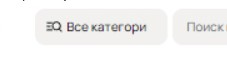
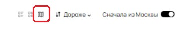
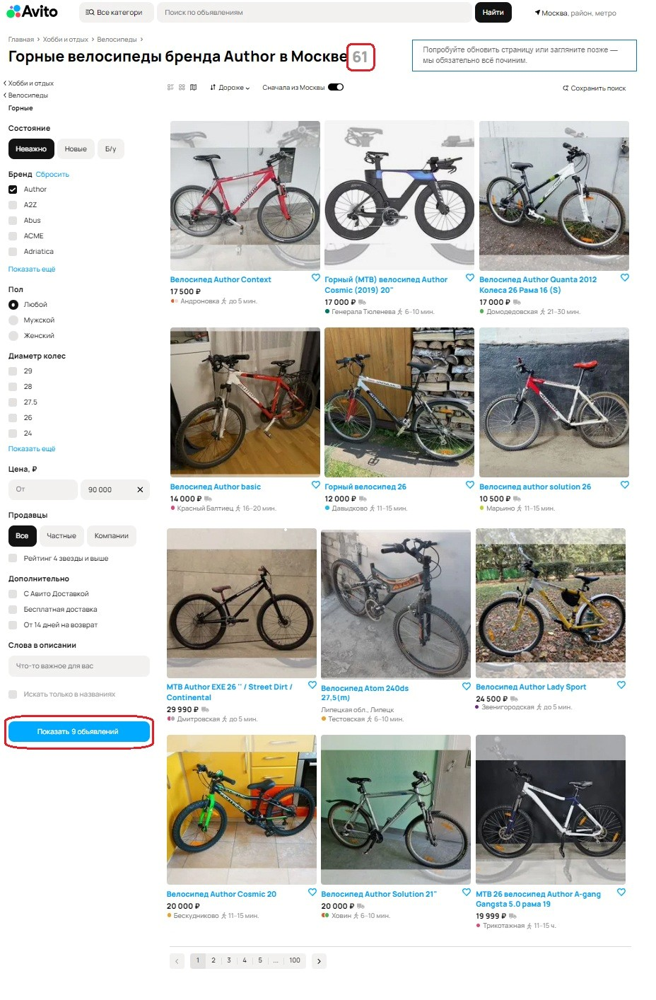
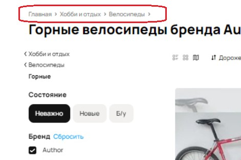
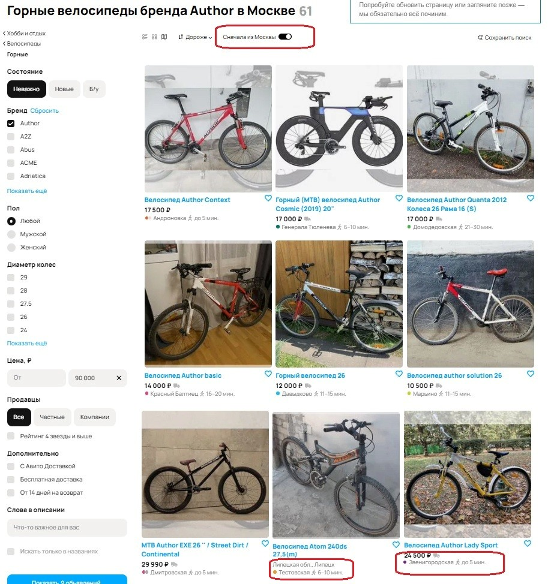
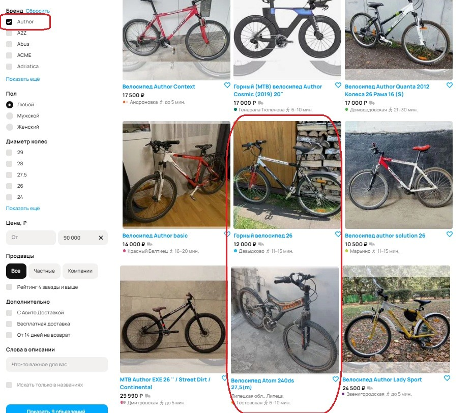

**Задание 1:**

**1)**	Опечатка на кнопке «Все категории». **Приоритет:** Low
  

   
**2)**	Установлена фильтрация «Дороже» (это значит, что на первой странице должны быть велосипеды дороже, далее в порядке убывания по цене, но это не так). **Приоритет:** High  
   
**3)**	По всей видимости нажат фильтр «Карты», значит страница должна быть открыта в виде карты. **Приоритет:** High
    
 
**4)**	На кнопке поиска указано «Показать 9 объявлений», а в результатах – 61 объявление. **Приоритет:** Medium
    

**5)**	Так как выбрана категория «Горные» (велосипеды), то на странице должно быть: «Главная > Хобби и отдых > Велосипеды > Горные»
**Приоритет:** Low   
  

**6)**	В фильтре указано «Сначала из Москвы». При этом в объявлениях на первой странице есть объявление из Санкт-Петербурга – станция метро Звенигородская и из Липецка. А затем снова идут объявления из Москвы. Это баг. **Приоритет:** Medium 
    

**7)**	Возможно, баг в том, что в области фильтрации выбран бренд «Author», а в результатах есть просто «Горный велосипед 26» и «велосипед Atom 240ds». Но, возможно, в описании этих велосипедов используется слово «Author», тогда не баг. Если баг, то **приоритет:** High
  
